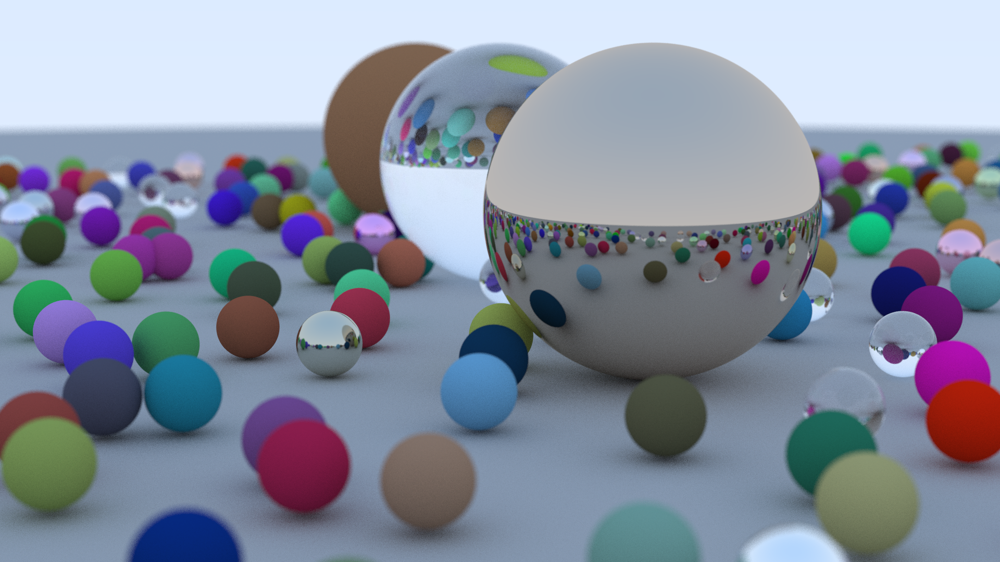

# raytrace in rust

Following along Peter Shirley's [Ray Tracing in One Weekend](https://raytracing.github.io/books/RayTracingInOneWeekend.html).

See [`progress/`](progress#progress) for images on the progress.

## Further reading

- [Computer Graphics from Scratch](https://gabrielgambetta.com/computer-graphics-from-scratch/) by Gabriel Gambetta

## The glorious result

