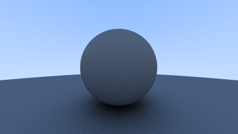
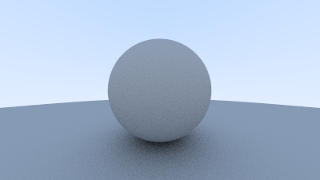
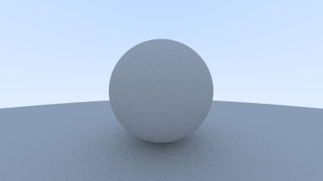
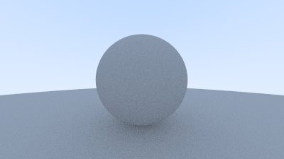
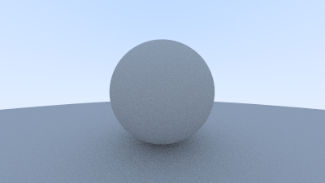
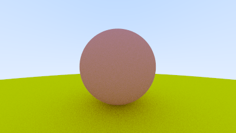
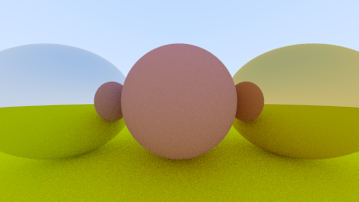
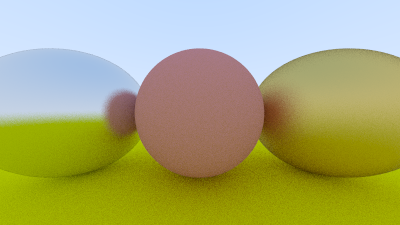

# Progress

## 00 Write a test image

## 01 Implement Vec3

## 02 Implement Color

## 03 Implement Ray

## 04 Render a Sphere

## 05 Implement hittable objects

## 06 Introduce "FACTOR" to scale up images

## 07 Implement output buffering

## 08 Move main.rs back to src/

## 09 Add LICENSE

## 10 Address Clippy's "ptr_arg"

## 11 Implement anti-aliasing

## 12 Add script to render image for each iteration

## 13 Simple diffuse material

## 14 Gamma correction

## 15 Improve reflections for diffuse material

## 16 Implement alternative diffuse method

## 17 Implement abstract material

## 18 Use scattering instead of randomness

## 19 Add Metal spheres

## 20 Metal: Implement fuzzy reflections

## 21 Add progress report

